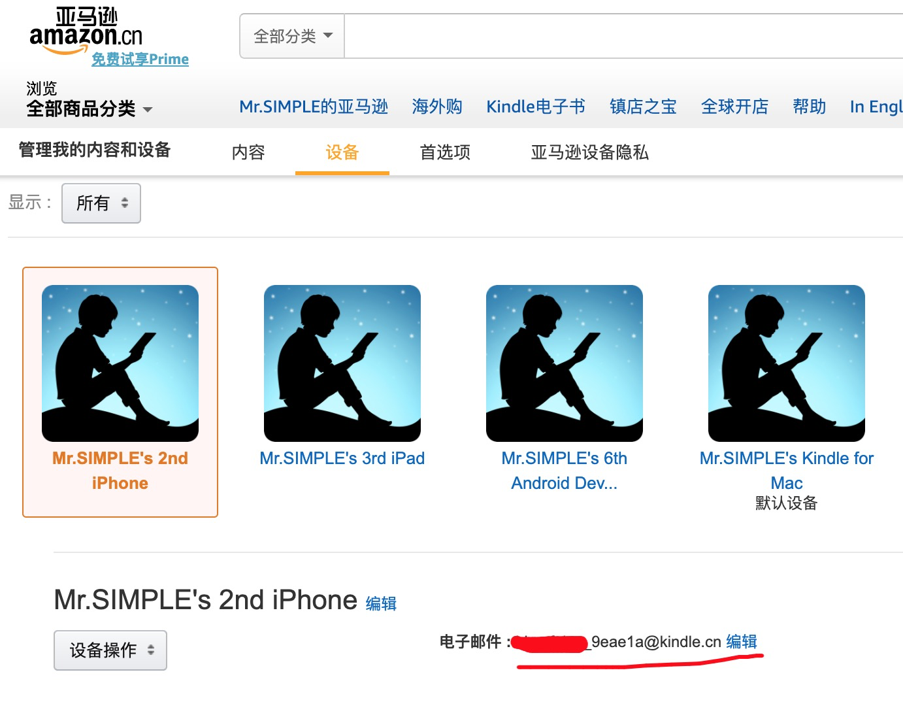
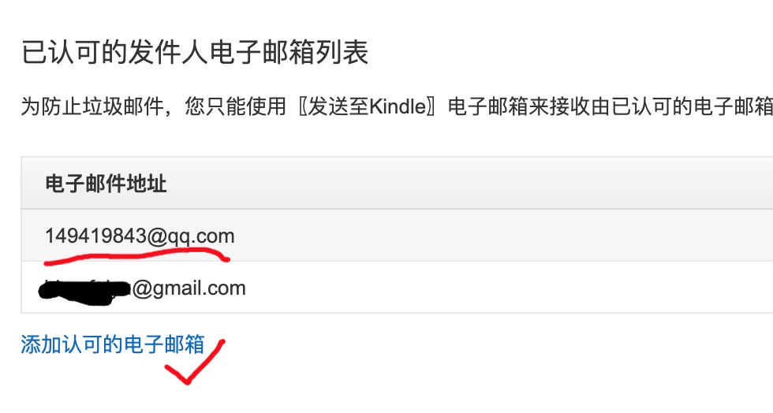

# 经济学人、纽约客 mobi、epub电子版下载
----

* [经济学人 - 周刊, 点击这里进入下载](01_economist/) , 每周五晚更新
* [纽约客 - 周刊, 点击这里进入下载](02_new_yorker/) , 每周日中午更新

## 如何手动下载

进入杂志的某一期中, 点击以 `mobi` 或者 `epub`结尾的文件, 进入类似于如下所示的页面 [TheEconomist_2018-12-29.mobi](https://github.com/hehonghui/the-economist-ebooks/blob/master/01_economist/te_2018-12-29/TheEconomist_2018-12-29.mobi), 然后点击右边的 `download` 按钮进行下载.

----
## 捐赠 & 订阅

> * 为了分摊服务器成本, 捐赠30元以上的用户可以享受一年**每周自动推送**经济学人、纽约客到**kindle设备**的福利, 免去手工搜索、下载的繁琐操作.
> * 没有捐赠的用户依然可以通过本项目**手动获取**到的所有电子书资源

**订阅方式如下:**

1. 获取到kindle设备的email地址, 登录到[亚马逊网站](https://www.amazon.cn/hz/mycd/myx#/home/devices/), 通过 `"我的账户" -> "管理我的内容和设备
" -> "设备"`选项进入到 kindle 设备列表, 找到你想接收电子书的kindle设备, 获取kindle邮件地址, 通常是以 `@kindle.cn`结尾 (红线处) . 如图所示:

1. 通过如下二维码捐赠, 在`付款备注`里填写自己的kindle设备email地址:    

2. 在亚马逊网站上 `"我的账户" -> "管理我的内容和设备
" -> "首选项"` 一栏, 然后将网页下拉到`"个人文档设置"`所在的位置 (需要按栏目右边的箭头展开), 在`"已认可的发件人电子邮箱列表"`一栏, 将`149419843@qq.com`添加到认可的电子邮箱中。如图所示:    

3. 之后每周即可获取到杂志的自动推送.

## FAQ

有任何订阅相关的问题可以通过 `149419843@qq.com` 咨询, 不保证及时回复，非盈利项目，只是为了好玩。
